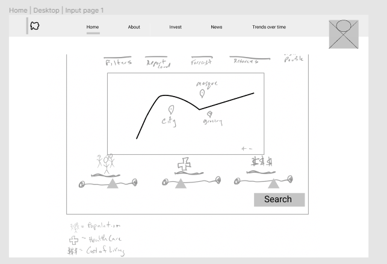
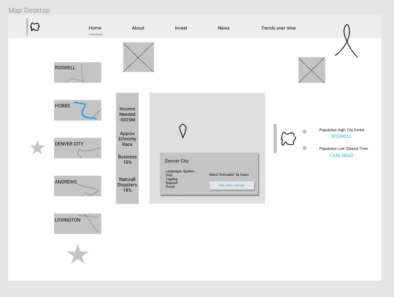
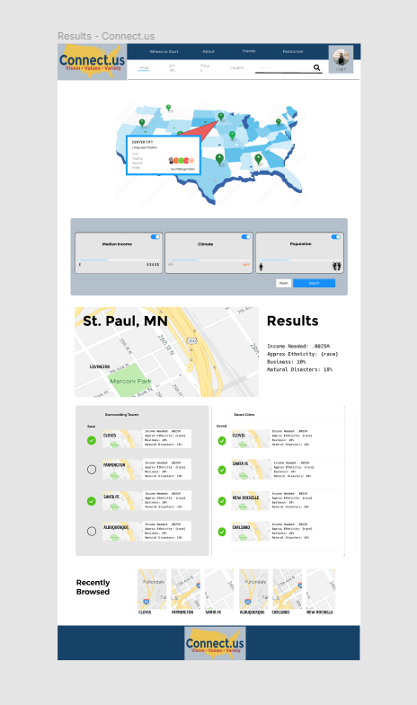
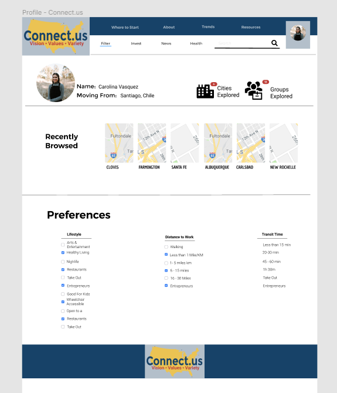
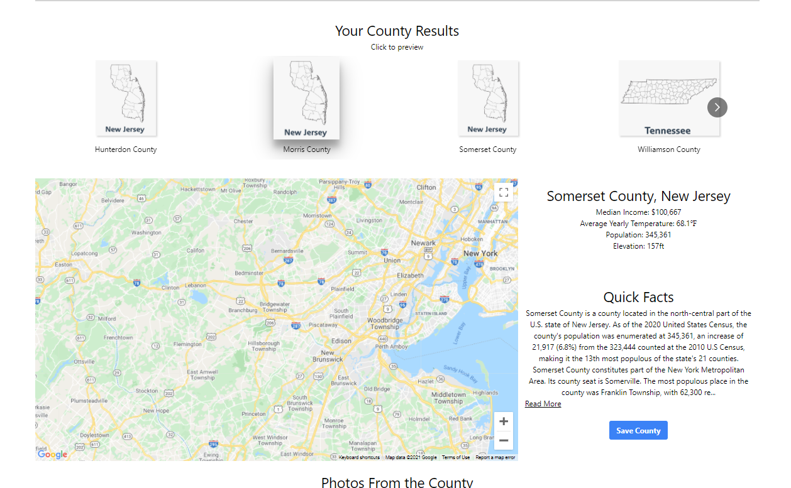

# Connect.US

## Introduction

There are many questions someone may have when relocating to the United States. 

Among the top, where should I live? 

Some are looking to find a place that are similar to their homeland. Some desire to try something new.

Some are looking for a real American experience while some are looking for cultural similarities to what they’re used to.

Our goal in this project, using data sets from the US Census Bureau, is to create a product that will allow people to find their next home based on Values, Variety and Vision for their life.

This site was built by a group of developers, data scientists and UXers that came together to solve the problem facing anyone relocating to this country for the first time.

# Table of Contents
- [Connect.US](#connectus)
  - [Introduction](#introduction)
- [Table of Contents](#table-of-contents)
- [Instructions for Use](#instructions-for-use)
- [Tech Framework](#tech-framework)
    - [This app uses:](#this-app-uses)
    - [We built this app with:](#we-built-this-app-with)
    - [This app is hosted at:](#this-app-is-hosted-at)
- [Future Plans](#future-plans)
- [Special Thanks](#special-thanks)
- [Appendices](#appendices)
  - [Appendix A: Project Pre-Planning](#appendix-a-project-pre-planning)
    - [User Stories](#user-stories)
    - [Databases](#databases)
    - [Wireframes & Mockups](#wireframes--mockups)
  - [Appendix B: Product Screenshots & Images](#appendix-b-product-screenshots--images)

[Back to Top](#top)

# Instructions for Use

A demo of this product is available: 

* [Connect.US Demo](https://www.loom.com/share/a26f9c5c547a4db3a628f31d15fb6288)

# Tech Framework

### This app uses:
* HTML5 and CSS
* JavaScript ES6
* Python 3.8.6
* [Node.js](https://nodejs.org/en/) v 15.9.0 & [Express](https://expressjs.com/) v 4.17.1
* [Tailwind CSS](https://tailwindcss.com/) v 2.1.1
* [dot env](https://www.npmjs.com/package/dotenv)
* [Googlemaps React-wrapper](https://www.npmjs.com/package/@googlemaps/react-wrapper)
* [React-Multi-Carousel](https://www.npmjs.com/package/react-multi-carousel)
* [React-Responsive-Carousel](https://www.npmjs.com/package/react-responsive-carousel)
* [CORS](https://www.npmjs.com/package/cors)
* [PostCSS](https://www.npmjs.com/package/postcss) & [Autoprefixer](https://www.npmjs.com/package/autoprefixer)
* [JSON Web Token](https://www.npmjs.com/package/jsonwebtoken) v 8.5.1

### We built this app with:
* [VSCode](https://code.visualstudio.com/) version 1.55.2
* [MongoDB Atlas](https://www.mongodb.com/cloud/atlas)
* [Google Chrome](https://www.google.com/chrome/) version 90.0.4430.85 (Official Build) (arm64)
* [Homebrew](https://brew.sh/) version 3.0.11
* Zsh version with [Oh My Zsh](https://ohmyz.sh/)
* [GitHub](https://github.com/) (online, not desktop)

### This app is hosted at:
* [Connect.US GitHub Repo](https://github.com/transcriptive/where-should-we-live)
* [Data Model Backend GitHub Repo](https://github.com/jabrusce/us_census_product_club)

* [Connect.US Heroku Hosted Site](https://connect-us-ga.herokuapp.com/)
* [Data Model Heroku Hosted Site](https://product-club-us-census.herokuapp.com/)
  

[Back to Top](#top)

# Future Plans
* Host the site at a white label URL 
* Configure Google Analytics.
* Add a password recovery feature.
* Add mobile-responsive CSS.
* Refactor file structure and code organization.
  * Move API calls, state, and other functions higher in the filetree for DRYer code.
  * Format code for a consistent overall appearance.
  * Change `href` anchors to React Router `<Link />` components.
* Add support for OAuth
  * Google, GitHub
  * Sync data models for OAuth information with the current `User` model.  Must have two-way referencing.
* Create additional pages and views.
  * Create a resources page to help the user with the transition to America
  * Create a groups section to allow users the ability to connect with other users
* Allow users to upload avatar images.
* Add administrative user roles and permissions.
* Create dark/light modes.

[Back to Top](#top)

# Special Thanks

* General Assembly Product Club Organizers(Becca Rogers, Shahier Rahman, Lea Berry, Chelsie Noble, Lisa Dubler)
  
* Mentors from General Assembly for collaboration in developing this app.

* Formatting this `README.md` file was easy with the help of the [Markdown Live Preview](https://markdownlivepreview.com/) tool and GitHub Guide's [Mastering Markdown](https://guides.github.com/features/mastering-markdown/) page.
* The code for this website was written with frequent reference to a number of 3rd party resources:
  * [Git-SCM](https://git-scm.com/docs)
  * [MDN Web Docs](https://developer.mozilla.org/en-US/)
  * [Mongoose Docs](https://mongoosejs.com/docs/guides.html)
  * [Stack Overflow](https://stackoverflow.com/)

[Back to Top](#top)

# Appendices

[Back to Top](#top)

## Appendix A: Project Pre-Planning

### User Stories

1. Carolina’s husband recieved a new job in the United States. She moved to Chile from Venezuela 6 years ago and married a Chilean.She has a pretty solid career as a software engineer but knows she and her husband can make a lot more money in the United States. She speaks fluent English however she is worried about the lack of affordable healthcare, racism, mass shootings and the extreme difficulty of legally moving to the United States as a Venezuelan. 

### Databases

**Model: User**  |  (user account metadata)
* `username` user's login handle (also display name)
* `email` user's email address
* `password` user's password (encrypted)
* `timestamps` (create/update)

**Model: Profile**  |  (profile data)
* `name` title of snippet
* `email` purpose of snippet
* `movingFrom` generic form/syntax of snippet
* `language` usage notes and information
* `recentCounties` example of snippet being used
* `savedCounties` topic tags for snippet
* `dateFormat` reference to `User` document of snippet creator
* `groups` (create/update)
* `byUser` ref to user model
* `timestamps` (create/update)

### Wireframes & Mockups

**Search Feature (React Component layout)**

**Results Feature (React Component Layout)**

**Search Page (React Component Layout)**

**Profile Page (React Component Layout)**

[Back to Top](#top)

## Appendix B: Product Screenshots & Images

**Deployed Search Page  | Current**

---

**Deployed Results Page  | Current**

